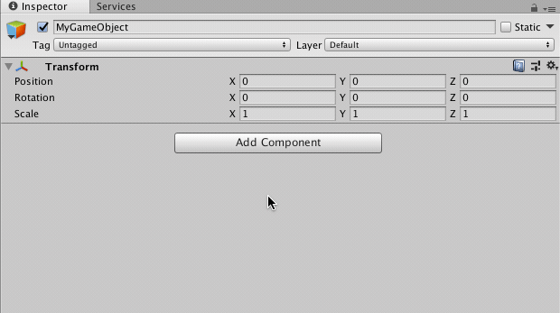

Attach comments directly to GameObjects or states in an animator.

These are very simple components, but it makes sense to install them via package dependency to avoid duplicating code.

## Install

From your unity project folder:

    npm init --force # only if you don't yet have a package.json file
    npm install --save beatthat/comments

The package and all its dependencies will be installed under Assets/Plugins/packages.

In case it helps, a quick video of the above: https://youtu.be/Uss_yOiLNw8

## Usage

Just add a `Comment` component to any GameObject or State in an Animator and fill in your comment in the inspector text field.
